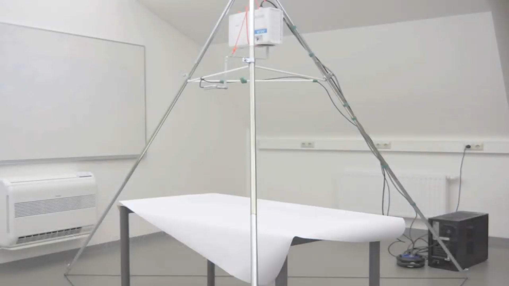
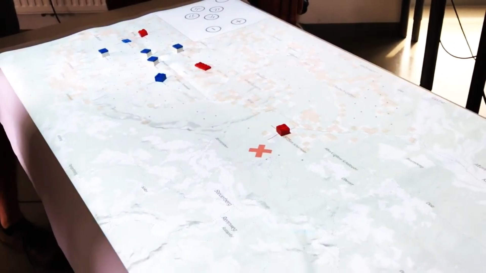
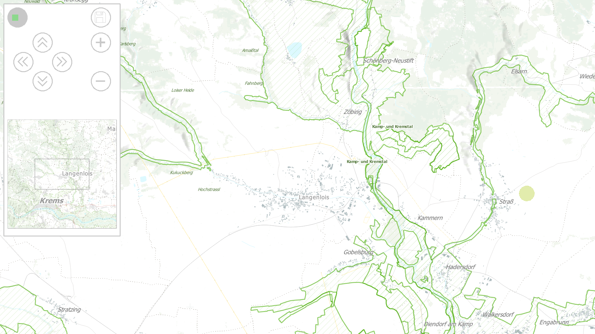
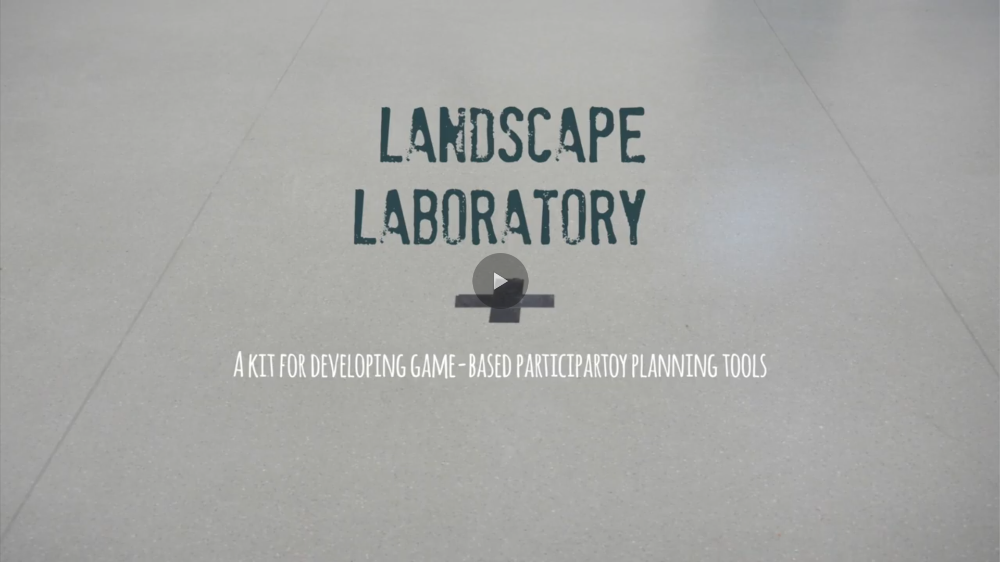

# LabTable

The LabTable is an open source application that can be used for geospatial planning projects.
A projector or large screen is used to display an image on a flat, vertical or horizontal surface.
Participants can now place interlocking bricks on the image to interact with the application.
A camera captures the bricks and image processing is used to calculate where each brick lies on the projected image.

Hardware Setup | Demonstration
:--|--:
 | 

# Setup

install python 3.6.8 (or 3.6.7 if corrupted)
install libraries if missing (see requirements.txt)
* at least at windows it is required to install libzbar0

for using life stream: 
	connect realsense camera 
	place four QR-codes to set the brick detection board

for using video (.bag) without camera:
	use an optional parameter 'usestream' with the .bag file name
(Note: .bag file can be recorded with RecordVideo/RecordVideo.py using realsense camera)

for saving the output as .avi file:
	def run(self, record_video=True):

# Run

run [server](https://github.com/boku-ilen/landscapelab-server)

run [QGIS-Plugin Remote Rendering](https://github.com/boku-ilen/landscapelab-qgis)

start as a module: python.exe -m LabTable

# Parameters
Optional:

--threshold 
  overwrites default threshold for black-white image to recognize qr-codes
  
--usestream
  path and name of the file with saved .bag stream
  
--ip
  overwrites default server ip defined in config
  
--scenario
  overwrites default starting scenario defined in config
  
--starting_location
  overwrites default starting location defined in config

# Examples
python.exe -m (...)/LabTable

(...)/python.exe -m (...)/LabTable --usestream=stream.bag --threshold=155
